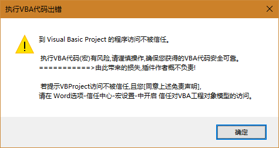
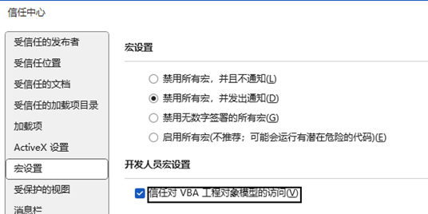
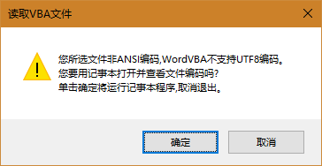
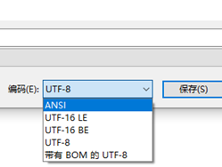
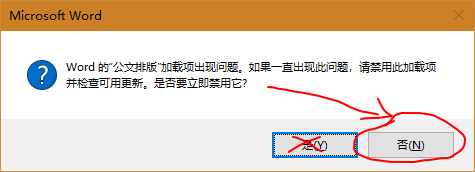

# 小恐龙公文排版助手VBA脚本操作指南

## 一、VBA功能能做什么？

尽管公文排版助手已经提供了大量的排版功能，但是具体到每个用户，往往众口难调。若插件本身集成大量繁杂的功能，不仅会影响运行速度，还可能增加更多bug，逐渐变得臃肿，这并不符合“小而美”的思想。
（一）实现更多功能，满足更多需求，比如《公文自动排版》、《多脚本批量修改》、《图片批量调整》……
（二）即用即走，文档不保存VBA代码，不占空间，减少安全隐患；
（三）VBA代码可见，可自由修改，保存和分享。

## 二、VBA脚本使用篇
### （一）使用方法：
第一步：先保存文档。（避免错误的VBA脚本造成损失）
第二步：点击“运行VBA”按钮，在打开脚本对话框里，选择一个合适的VBA脚本即可。
第三步：部分VBA会有交互操作，按照提示进行。

### （二）注意事项：
VBA脚本的后缀名通常为.vba或者.bas。
一般来说.vba是专用于本插件的脚本，.bas则是Word Visual Basic编辑器导出的脚本。
它们都可以执行，但是.bas并不是专为插件服务，有可能存在一些bug或兼容性问题，需要代码制作者略作修改。
注意：请务必保证VBA代码安全可靠，插件作者不承担VBA脚本造成的任何损失！

您可将VBA脚本上传到https://www.virscan.org/进行病毒检验。
 
### （三）常见问题：
#### 问题一:VB Project访问不被信任

解决方法：您可以按下图开启选项：

勾选“禁用所有宏，并发出通知”（保障安全性）
勾选“信任对VBA工程对象模型的访问”，（开启本功能）
 
#### 问题二：无法执行指定的宏
通常情况下，是所选的.vba脚本有bug，导致其无法执行。
您可以联系代码作者或分享人，也可以用记事本自行查看该脚本。

#### 问题三：所选脚本非ANSI编码

解决方法：
记事本另存时选择ANSI编码即可，其他编辑器可选为简体中文GB2312(代码页936)。

#### 问题四：异常来自HRESULT:0x800A802D的错误提示
运行错误的VBA代码导致Word解释器出错，在当前文档残留有执行失败的模块脚本。
解决方法：点击 代码清理 按钮即可。

#### 问题五：代码陷入死循环导致Word停止响应。
先尝试按Ctrl+Break中断执行，若无法中断，解决方法如下：
第一步：关闭并重启Word。
第二步：遇到下图对话框，千万记得点“否”：

第三步：通常Word会提示恢复未保存的文档。
如果提示有未启用的宏，清理VBA代码后保存即可。
第四步：然后核实检查VBA代码是否兼容插件或存在Bug不，具体可参见下“VBA脚本制作篇”。

#### 问题六：WPS运行时出错

解决办法：
第一步:开发工具->切换到VB环境 
[免费切换VB环境的方法](https://www.bilibili.com/video/BV19y4y1X7DE/)
 
第二步: WPS 选项 -> 信任中心-> 宏安全性 -> 可靠发行商勾选“信任对于VB项目的访问” 

## 三、VBA脚本制作篇
### （一）获取VBA脚本最常用的方法
1．找个AI网站,比如通义千问,让它帮你写一个Word VBA脚本，复制到记事本，存为 xxx.vba即可。
2．使用Word宏功能来录制你的操作,然后编辑宏代码,导出为.bas脚本。
经过调试验证后的代码脚本，建议保存为.vba再分享。
### （二）制作VBA需要注意的问题
*	一个VBA只做一件事，制作VBA脚本时,请只保留一个Sub……End Sub代码块用于执行,其他调用过程改用Function关键字。
*	VBA脚本请使用ANSI(简体中文GB2312)编码保存,Word VBA不支持UTF-8这类编码,会导致中文乱码。
*	不正确的代码可能导致Word崩溃、文档丢失或损坏，请勿故意制作和传播具有破坏性的VBA脚本，否则可能触犯刑法第285和286条。
*	分享或复制VBA代码时，请尊重作者版权，注明来源，保留注释。
